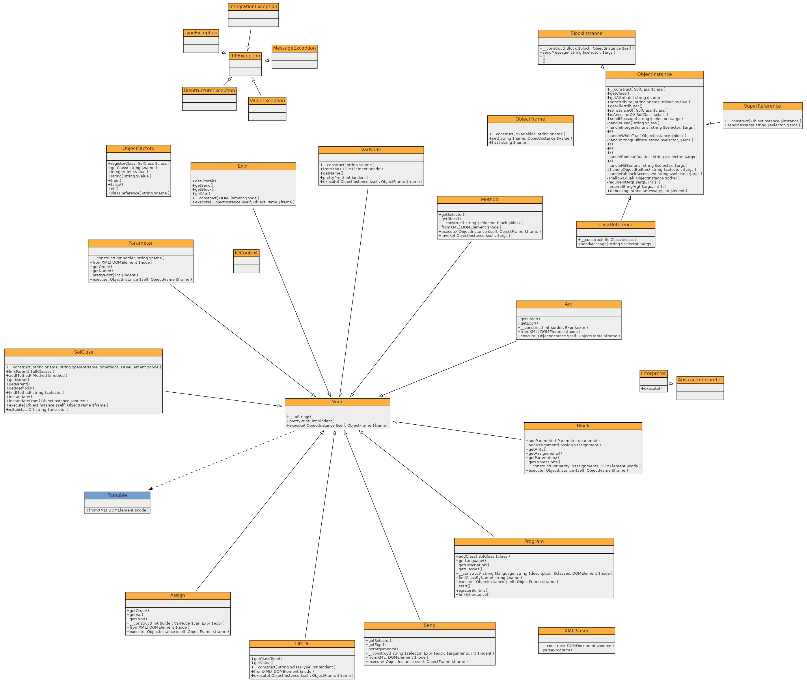

# Implementation Documentation for Assignment 2 of IPP 2024/2025

**Name and Surname:** Aleš Urbánek  
**Login:** xurbana00
---

## Brief Purpose Description

This interpreter reads the XML representation of a SOL25 program generated by the `parse.py` script and executes the
program according to this AST. The interpreter is implemented in PHP 8.4 using an object-oriented design.

## 1. Architecture and Interpreter Design

The interpreter is built using object-oriented principles, where each class represents an AST node or a component of the
runtime environment (e.g., `Block`, `Expr`, `Assign`, `Method`, `SolClass`, `Program`).

- Classes like `Node`, `Expr`, `Literal`, `Assign`, `Block`, and `Send` represent various AST nodes.
- The `XMLParser` class converts the input XML into corresponding objects.
- The `Interpreter` class starts the execution by creating an instance of the `Main` class and invoking its `run`
  method.

## 2. Internal Representation and Runtime Environment

The internal structure of the interpreter is based on fundamental object-oriented programming (OOP) principles:
Encapsulation, inheritance, and polymorphism.

### Encapsulation

Each AST node is implemented as a class that encapsulates the behavior relevant to its role. All AST node classes
implement the `Parsable` interface, which ensures a uniform API for parsing and execution. Each node class defines an
`execute` method that performs its associated logic. Unlike typical interpreters that differentiate between evaluable
and executable nodes, this implementation unifies execution behavior through the `execute` method only.

### Runtime Objects and I/O Context

The runtime environment is modeled as an object-oriented system built around class instances, message passing, and
encapsulated state:

- `ObjectInstance` represents an instance of a class, including access to its attributes and methods.
- `ObjectFrame` serves as the internal structure for storing instance variables (attributes) within an object.
- `BlockInstance` models runtime blocks (anonymous functions) and carries lexical scope where needed.

For interaction with the user and the outside world, the interpreter uses the `IOContext` class:

- `IOContext` provides facilities for reading input from `stdin` and writing output or error messages to `stdout` and
  `stderr`.
- It is used by built-in operations like `print`, `read`, or internal debugging or error reporting tools.

This organization ensures that runtime execution is modular and flexible, with clearly separated logic for computation
and I/O handling.

Each object carries its own data and behavior, and messages (method calls) are dispatched based on class definitions and
inheritance, allowing full object interaction during interpretation.

This design enables clear, maintainable, and modular code, which mirrors the language semantics and supports
extensibility (e.g., adding new AST node types or modifying runtime behavior with minimal changes).

### Inheritance and Polymorphism

The abstract class `Node` serves as a base for all AST node types, such as `Assign`, `Expr`, `Literal`, `Block`, and
`Send`. These subclasses override the base behavior according to their semantics in the SOL25 language.

- Inheritance enables code reuse and a clear hierarchy of syntactic constructs.
- Polymorphism allows the interpreter to work with AST nodes through a common interface (`Parsable`), enabling dynamic
  dispatch of `evaluate()` or `execute()` at runtime without type checking.

## 3. Message Sending and Expressions

Nodes of type `Send` represent messages sends to objects in the SOL25 language. Message sending is the central operation
in SOL25, which covers both method calls and attribute access.

Message sends are evaluated by the `sendMessage()` method of the `ObjectInstance` class, which performs message
resolution using a structured fallthrough mechanism:

1. **Search in current class:** The interpreter first checks whether the object's class (accessible via its `SolClass`
   reference) defines a method matching the selector. If found, the associated block is invoked.
2. **Search in built-in class (parent):** If the method is not found in the user-defined class, the interpreter attempts
   to locate it in the parent (built-in) class. This supports behavior inheritance from built-in types like `String`,
   `Integer`, or `Block`.
3. **Search in `Object`:** If still unresolved, the method lookup continues in the root class `Object`, which provides
   default implementations for common behaviors (e.g., `asString`, `equalTo:`).
4. **Getter/Setter fallback:** If no method is found and the selector corresponds to an existing attribute name (with or
   without trailing `:`), the interpreter treats it as an attribute access or assignment (getter/setter). For example:
    - `x name` will return the value of attribute `name` (getter).
    - `x name: "value"` will update or create the attribute `name` (setter).
5. **Failure and exception:** If none of the above steps resolve the message, a `MessageException` is thrown with the
   appropriate error code (typically 51), indicating that the object does not understand the given message.

This fallthrough logic mimics dynamic dispatch in prototype-based or dynamically typed OOP languages. It ensures that
inherited behaviors are accessible and simple attribute accessors can be written idiomatically using the same
message-sending syntax.

The `super` keyword is also supported: it redirects method lookup to the parent class of the current object, which
allows method overriding with access to the base implementation.

## 4. UML Diagram

The following UML diagram illustrates the core structure of the interpreter’s classes and their relationships:

